<h2>Design Pattern Strategy</h2>
<h3>Concept</h3>
<h4>Le <strong>Pattern Strategy</strong> est un patron de conception 
comportemental qui permet de définir une famille d'algorithmes, 
de les encapsuler dans des classes séparées et de rendre leurs objets interchangeables.
</h4>
<h3> Quel problème ce design pattern permet de résoudre</h3>
<h4>Le pattern Strategy permet de gérer les situations où il y a plusieurs cas figures à implémenter (Orienté Objet) lors du développement d'une application. 
Par exemple : Imagninez que vous développez une application de navigation qui doit calculer des itinéraires. Il pourra avoir différentes stratégies de calcul:
<ul>
<li><strong>Route la plus rapide</strong></li>
<li><strong>Route la plus courte</strong></li>
<li><strong>Route évitant les péages</strong></li>
<li><strong>Route touristique</strong></li>
</ul>
Sans le pattern Strategy, l'on se retrouvera avec une classe contenant de multiples conditions :
</h4>
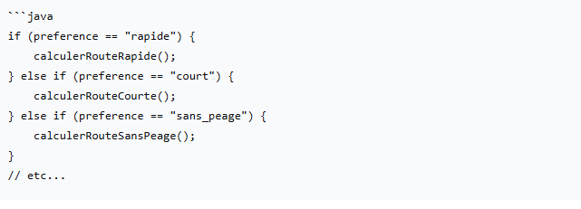
<h4>Cette approche devient rapidement ingérable et viole le principe ouvert à l'extension et fermé à la modification.</h4>
<h3>Solution</h3>
Le pattern Strategy propose de :
<ol>
<li>Définir une interface commune pour toutes les variantes d'algorithmes</li>
<li>Extraire chaque algorithme dans sa propre classe</li>
<li>Rendre les algorithmes interchangeables à la volée</li>
</ol>
<h3>Structure UML</h3>
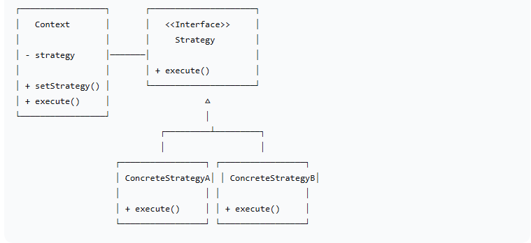
<h3>Exemple d'Implémentation</h3>
<h4>Interface Strategy</h4>
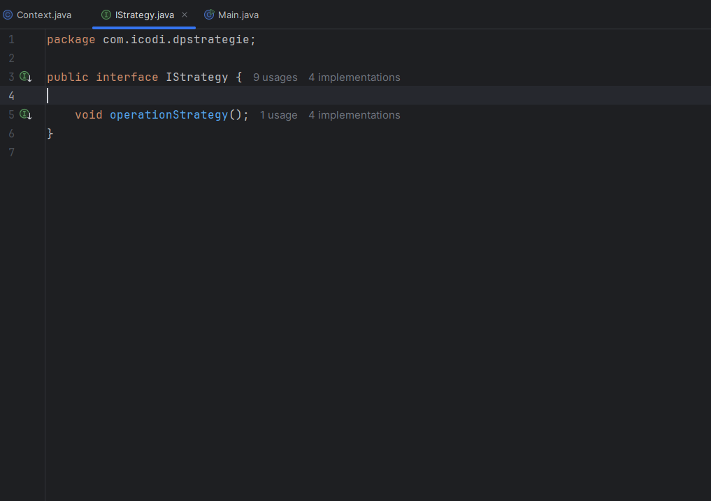
<h4>Stratégies Concrètes</h4>

 
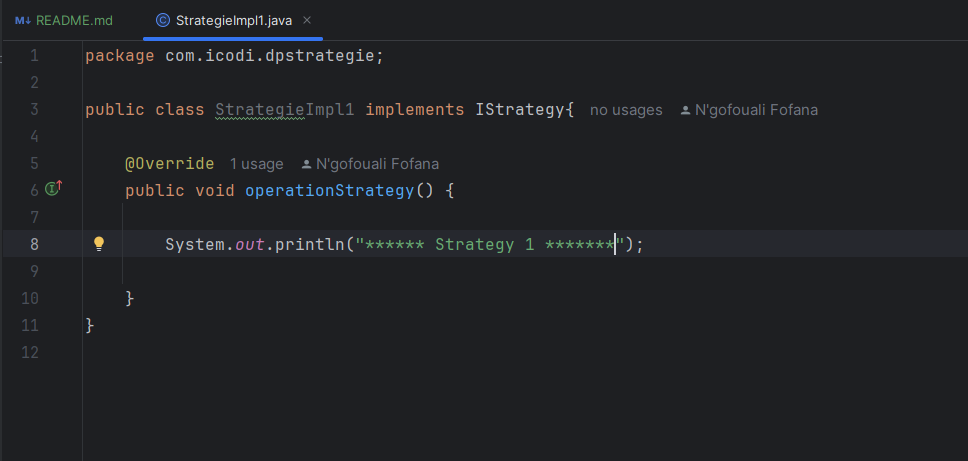
 
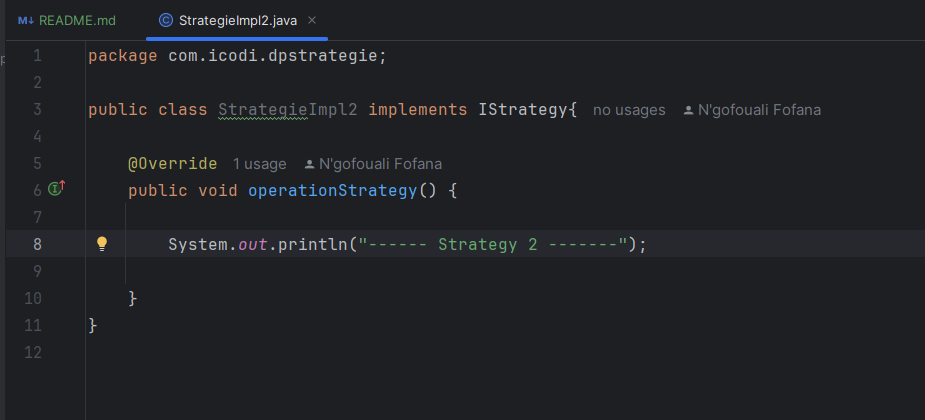
 
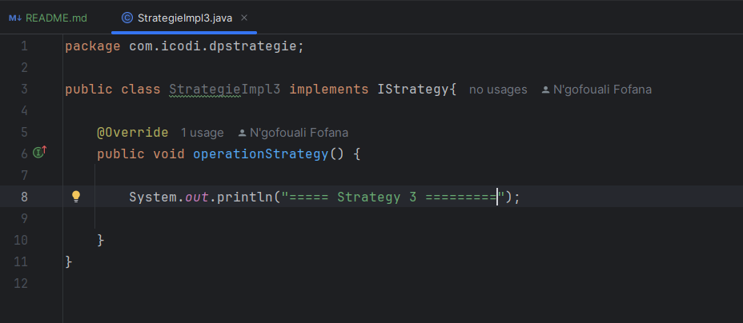
<h4>Context</h4>
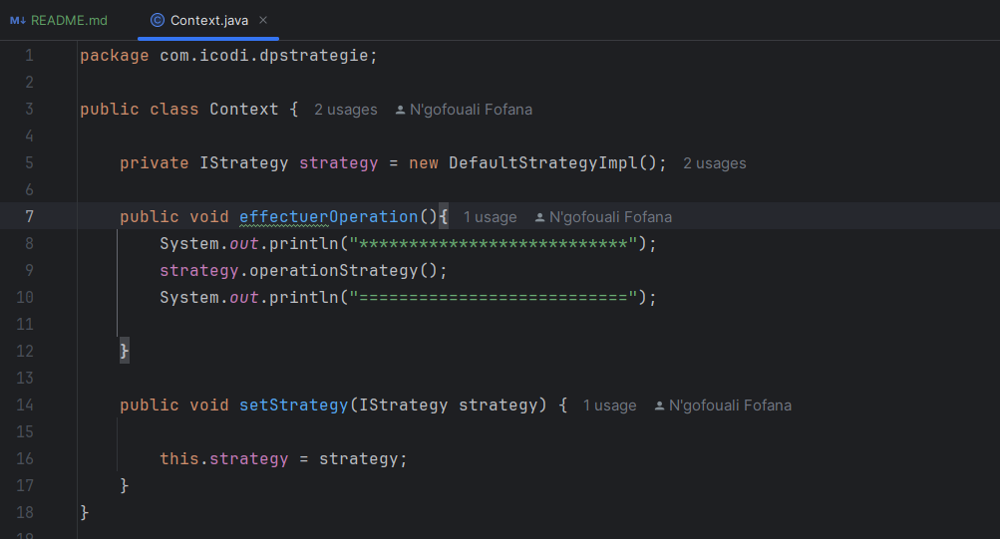
<h3>Classe d'utilisation</h3>
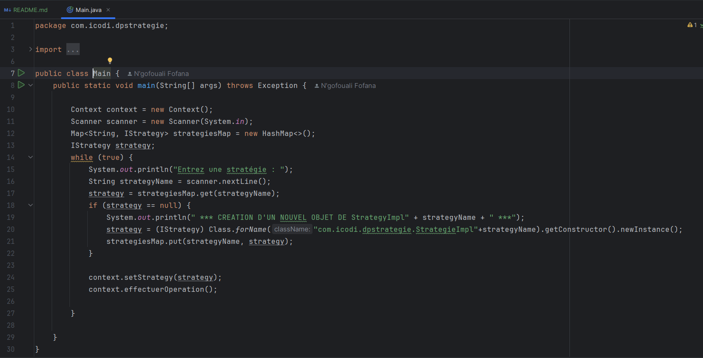
<h3>Résultats</h3>
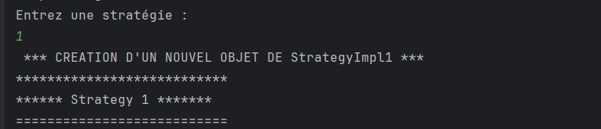
 
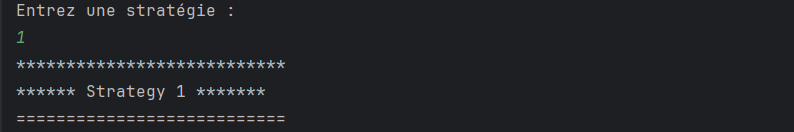
 
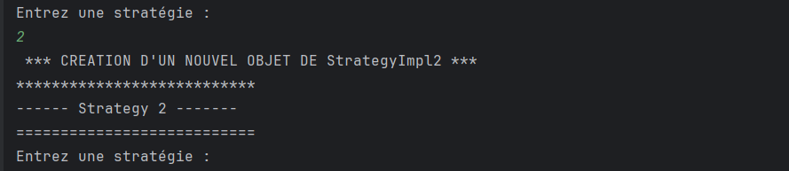
<h3>Avantages</h3>
<ul>
<li>Principe ouvert/fermé : Nouveaux algorithmes sans modifier le contexte</li>
<li>Évite les conditions complexes : Plus de switch/if-else</li>
<li>Réutilisabilité : Stratégies utilisables dans différents contextes</li>
<li>Testabilité : Chaque stratégie peut être testée unitairement</li>
<li>Flexibilité : Changement d'algorithme à l'exécution</li>
</ul>
 
<h3>Inconvénients</h3>
<ul>
<li>Complexité accrue : Plus de classes dans le projet</li>
<li>Client doit connaître les stratégies : Le client doit choisir la stratégie appropriée</li>
<li>Surcharge de communication : Interface commune peut être trop générique</li>
</ul>
 
<h3>Cas d'Utilisation</h3>
<ul>
<li>Systèmes de paiement</li>
<li>Algorithmes de tri (tri rapide, tri fusion, tri par insertion)</li>
<li>Compression de fichiers (ZIP, RAR, 7Z)</li>
<li>Navigation (voiture, piéton, transports)</li>
<li>Rendu graphique (OpenGL, DirectX)</li>
<li>Rendu graphique (OpenGL, DirectX)</li>
<li>Validation de données (différents formats, différentes règles)</li>
</ul>
